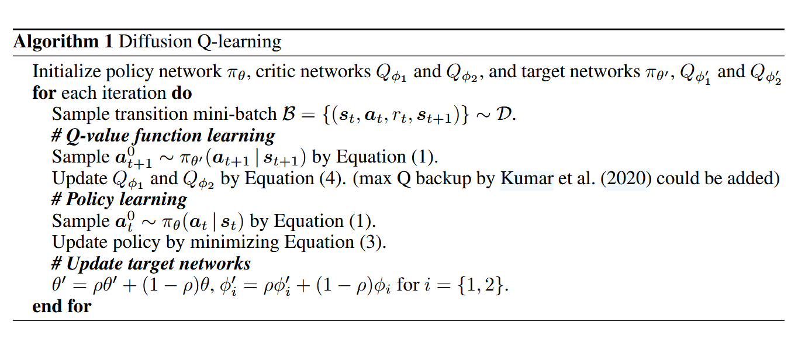

- learn an action-value function
- add a term maximizing action-values into the training loss of the conditional diffusion model --- which results in a loss that seeks optimal actions that are near the behavior policy.
- show the expressiveness of the diffusion model-based policy, and the coupling of the behavior cloning and policy improvement under the diffusion model both contribute to the outstanding performance of Diffusion-QL.

## 1 Introduction

Applying standard policy improvement approaches to an offline dataset typically leads to relying on evaluating actions that have not been seen in the dataset, and therefore their values are unlikely to be estimated accurately.

previous solutions:
- regularize how far the policy can deviate from the behavior policy
- constrain the learned value function to assign low values to out-of-distribution actions
- introduce model-based methods, which learn a model of the environment dynamics and perform pessimistic planning in the learned Markov decision process (MDP)
- treat offline RL as a problem of sequence prediction with return guidance

policy-regularized RL 
- policy regularization methods perform poorly due to their limited ability to accurately represent the behavior policy.
- the policy regularization may limit the exploration space of the agent to a small region with only suboptimal actions.

The inaccurate policy regularization occurs for two main reasons
- policy classes are not expressive enough
- the regularization methods are improper

In this paper, 
- construct an objective for the diffusion loss which contains two terms
    - a behavior-cloning term that encourages the diffusion model to sample actions in the same distribution as the training set
    - a policy improvement term that attempts to sample high-value actions (according to a learned Q-value).
- Our diffusion model is a conditional model with states as the condition and actions as the outputs.

Applying a diffusion model here has several appealing properties
- very expressive and can well capture multi-modal distributions
- the diffusion model loss constitutes a strong distribution matching technique and hence it could be seen as a powerful sample-based policy regularization method without the need for extra behavior cloning.
- diffusion models perform generation via iterative refinement, and the guidance from maximizing the Q-value function can be added at each reverse diffusion step.

## 2 Diffusion Q-learning

### 2.1 Diffusion policy

We represent our RL policy via the reverse process of a conditional diffusion model as
$$
\pi_\theta(\boldsymbol{a}\mid\boldsymbol{s})=p_\theta(\boldsymbol{a}^{0:N}\mid\boldsymbol{s})=\mathcal{N}(\boldsymbol{a}^N;\boldsymbol{0},\boldsymbol{I})\prod_{i=1}^Np_\theta(\boldsymbol{a}^{i-1}\mid\boldsymbol{a}^i,\boldsymbol{s})
$$
where the end sample of the reverse chain, $a^0$, is the action used for RL evaluation. Generally, $p_\theta(a^{i-1}|a^i,s)$ could be modeled as a Gaussian distribution $\mathcal{N}(a^i-1;\boldsymbol{\mu}_\theta(a^i,s,i),\boldsymbol{\Sigma}_\theta(\boldsymbol{a}^i,\boldsymbol{s},i)).$ We follow Ho et al. (2020) to parameterize $p_\theta(a^{i-1}|a^i,s)$ as a noise prediction model with the covariance matrix fıxed as $\Sigma_\theta(\dot{\boldsymbol{a}}^i,s,i)=\beta_i\dot{\boldsymbol{I}}$ and mean constructed as
$$
\boldsymbol{\mu}_\theta(\boldsymbol{a}^i,\boldsymbol{s},i)=\frac1{\sqrt{\alpha_i}}\big(\boldsymbol{a}^i-\frac{\beta_i}{\sqrt{1-\bar{\alpha}_i}}\boldsymbol{\epsilon}_\theta(\boldsymbol{a}^i,\boldsymbol{s},i)\big)
$$
We first sample $a^N\sim\mathcal{N}(0,I)$ and then from the reverse diffusion chain parameterized by $\theta$ as
$$
\boldsymbol{a}^{i-1}\:|\:\boldsymbol{a}^{i}=\frac{\boldsymbol{a}^{i}}{\sqrt{\alpha_{i}}}-\frac{\beta_{i}}{\sqrt{\alpha_{i}(1-\bar{\alpha}_{i})}}\boldsymbol{\epsilon}_{\boldsymbol{\theta}}(\boldsymbol{a}^{i},\boldsymbol{s},i)+\sqrt{\beta_{i}}\boldsymbol{\epsilon},\:\boldsymbol{\epsilon}\sim\mathcal{N}(\boldsymbol{0},\boldsymbol{I}),\:\mathrm{for~}i=N,\ldots,1.
$$
Following DDPM (Ho et al., 2020), when $i=1,\boldsymbol{\epsilon}$ is set as $\mathbf{0}$ to improve the sampling quality.
We mimic the simplified objective proposed by Ho et al. (2020) to train our conditional $\epsilon$-model via
$$
\mathcal{L}_d(\theta)=\mathbb{E}_{i\thicksim\mathcal{U},\boldsymbol{\epsilon}\thicksim\mathcal{N}(\boldsymbol{0},\boldsymbol{I}),(\boldsymbol{s},\boldsymbol{a})\thicksim\mathcal{D}}\left[||\boldsymbol{\epsilon}-\boldsymbol{\epsilon}_{\boldsymbol{\theta}}(\sqrt{\bar{\alpha}_i}\boldsymbol{a}+\sqrt{1-\bar{\alpha}_i}\boldsymbol{\epsilon},\boldsymbol{s},i)||^2\right],
$$
where $\mathcal{U}$ is a uniform distribution over the discrete set as $\{1,\ldots,N\}$ and $\mathcal{D}$ denotes the offline dataset, collected by behavior policy $\pi_b.$ 

This diffusion model loss $\mathcal{L}_d(\theta)$ is a behavior-cloning loss, which aims to learn the behavior policy $\pi_{b}(a\mid s)$ (i.e. it seeks to sample actions from the same distribution as the training data). 

To work with small $N$,with $\beta_\mathrm{min}=0.1$ and $\beta_\mathrm{max}=10.0$, we follow to define
$$
\beta_i=1-\alpha_i=1-e^{-\beta_{\min}(\frac{1}{N})-0.5(\beta_{\max}-\beta_{\min})\frac{2i-1}{N^2}},
$$
which is a noise schedule obtained under the variance preserving SDE.

### 2.2 Q-learning

To improve the policy, we inject Q-value function guidance into the reverse diffusion chain in the training stage in order to learn to preferentially sample actions with high values.

The final policy-learning objective is a linear combination of policy regularization and policy improvement:
$$
\pi=\arg\min_{\pi_\theta}\mathcal{L}(\theta)=\mathcal{L}_d(\theta)+\mathcal{L}_q(\theta)=\mathcal{L}_d(\theta)-\alpha\cdot\mathbb{E}_{\boldsymbol{s}\sim\mathcal{D},\boldsymbol{a}^0\sim\pi_\theta}\left[Q_\phi(\boldsymbol{s},\boldsymbol{a}^0)\right].
$$
As the scale of the Q-value function varies in different offline datasets, to normalize it, we follow  Fujimoto & Gu (2021) to set $α$ as $\alpha=\frac{\eta}{\mathbb{E}_{{(\boldsymbol{s},\boldsymbol{a})\thicksim\mathcal{D}}}[[Q_{\phi}(\boldsymbol{s},\boldsymbol{a})]]}$, where $η$ is a hyperparameter that balances  the two loss terms and the Q in the denominator is for normalization only and not differentiated over.

