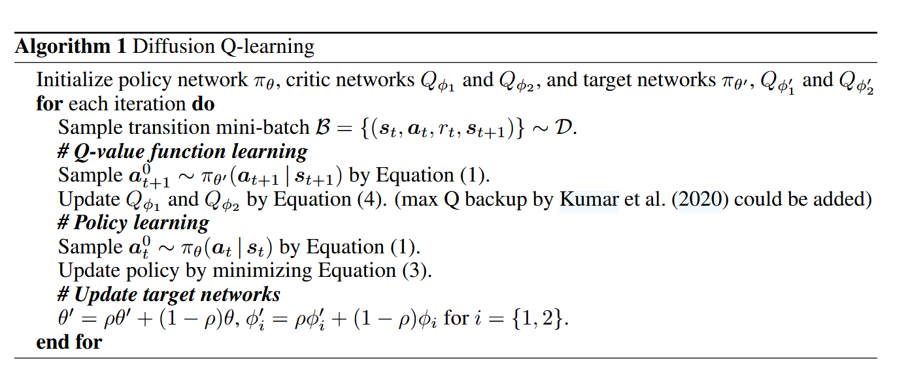

## 1 Introduction

Offline reinforcement learning (RL) faces a fundamental challenge: how to estimate the values of out-of-distribution actions, since we can't interact with the environment directly. Several strategies aim to address this issue:

1. **Policy regularization**: This limits how far the learned policy can deviate from the behavior policy.
2. **Value function constraints**: The learned value function assigns low values to out-of-distribution actions.
3. **Model-based methods**: These learn an environment model and perform pessimistic planning in the learned MDP.
4. **Sequence prediction**: Treating offline RL as a sequence prediction problem with return guidance.

While policy regularization has shown promise, it often leads to suboptimal results. **The reason?** Policy regularization methods are typically unable to accurately represent the behavior policy, which in turn limits exploration and leads the agent to converge on suboptimal actions. In other words, for regularization to work, it needs to be able to faithfully capture the behavior policy.

Common regularization techniques like **KL divergence** and **maximum mean discrepancy (MMD)** often fall short in offline RL. These methods either require explicit density values or multiple action samples at each state, complicating the optimization process. This makes them less effective for offline RL settings.

## 2 Diffusion Q-learning

### 2.1 Diffusion policy

We represent our RL policy via the reverse process of a conditional diffusion model as
$$
\pi_\theta(\boldsymbol{a}\mid\boldsymbol{s})=p_\theta(\boldsymbol{a}^{0:N}\mid\boldsymbol{s})=\mathcal{N}(\boldsymbol{a}^N;\boldsymbol{0},\boldsymbol{I})\prod_{i=1}^Np_\theta(\boldsymbol{a}^{i-1}\mid\boldsymbol{a}^i,\boldsymbol{s})
$$
where the end sample of the reverse chain, $a^0$, is the action used for RL evaluation. Generally, $p_\theta(a^{i-1}|a^i,s)$ could be modeled as a Gaussian distribution $\mathcal{N}(a^i-1;\boldsymbol{\mu}_\theta(a^i,s,i),\boldsymbol{\Sigma}_\theta(\boldsymbol{a}^i,\boldsymbol{s},i)).$ We follow Ho et al. (2020) to parameterize $p_\theta(a^{i-1}|a^i,s)$ as a noise prediction model with the covariance matrix fıxed as $\Sigma_\theta(\dot{\boldsymbol{a}}^i,s,i)=\beta_i\dot{\boldsymbol{I}}$ and mean constructed as
$$
\boldsymbol{\mu}_\theta(\boldsymbol{a}^i,\boldsymbol{s},i)=\frac1{\sqrt{\alpha_i}}\big(\boldsymbol{a}^i-\frac{\beta_i}{\sqrt{1-\bar{\alpha}_i}}\boldsymbol{\epsilon}_\theta(\boldsymbol{a}^i,\boldsymbol{s},i)\big)
$$
We first sample $a^N\sim\mathcal{N}(0,I)$ and then from the reverse diffusion chain parameterized by $\theta$ as
$$
\boldsymbol{a}^{i-1}\:|\:\boldsymbol{a}^{i}=\frac{\boldsymbol{a}^{i}}{\sqrt{\alpha_{i}}}-\frac{\beta_{i}}{\sqrt{\alpha_{i}(1-\bar{\alpha}_{i})}}\boldsymbol{\epsilon}_{\boldsymbol{\theta}}(\boldsymbol{a}^{i},\boldsymbol{s},i)+\sqrt{\beta_{i}}\boldsymbol{\epsilon},\:\boldsymbol{\epsilon}\sim\mathcal{N}(\boldsymbol{0},\boldsymbol{I}),\:\mathrm{for~}i=N,\ldots,1.
$$
Following DDPM (Ho et al., 2020), when $i=1,\boldsymbol{\epsilon}$ is set as $\mathbf{0}$ to improve the sampling quality.
We mimic the simplified objective proposed by Ho et al. (2020) to train our conditional $\epsilon$-model via
$$
\mathcal{L}_d(\theta)=\mathbb{E}_{i\thicksim\mathcal{U},\boldsymbol{\epsilon}\thicksim\mathcal{N}(\boldsymbol{0},\boldsymbol{I}),(\boldsymbol{s},\boldsymbol{a})\thicksim\mathcal{D}}\left[||\boldsymbol{\epsilon}-\boldsymbol{\epsilon}_{\boldsymbol{\theta}}(\sqrt{\bar{\alpha}_i}\boldsymbol{a}+\sqrt{1-\bar{\alpha}_i}\boldsymbol{\epsilon},\boldsymbol{s},i)||^2\right],
$$
where $\mathcal{U}$ is a uniform distribution over the discrete set as $\{1,\ldots,N\}$ and $\mathcal{D}$ denotes the offline dataset, collected by behavior policy $\pi_b.$ 

This diffusion model loss $\mathcal{L}_d(\theta)$ is a behavior-cloning loss, which aims to learn the behavior policy $\pi_{b}(a\mid s)$ (i.e. it seeks to sample actions from the same distribution as the training data). 

To work with small $N$,with $\beta_\mathrm{min}=0.1$ and $\beta_\mathrm{max}=10.0$, we follow to define
$$
\beta_i=1-\alpha_i=1-e^{-\beta_{\min}(\frac{1}{N})-0.5(\beta_{\max}-\beta_{\min})\frac{2i-1}{N^2}},
$$
which is a noise schedule obtained under the variance preserving SDE.

### 2.2 Q-learning

To improve the policy, we inject Q-value function guidance into the reverse diffusion chain in the training stage in order to learn to preferentially sample actions with high values.

The final policy-learning objective is a linear combination of policy regularization and policy improvement:
$$
\pi=\arg\min_{\pi_\theta}\mathcal{L}(\theta)=\mathcal{L}_d(\theta)+\mathcal{L}_q(\theta)=\mathcal{L}_d(\theta)-\alpha\cdot\mathbb{E}_{\boldsymbol{s}\sim\mathcal{D},\boldsymbol{a}^0\sim\pi_\theta}\left[Q_\phi(\boldsymbol{s},\boldsymbol{a}^0)\right].
$$
As the scale of the Q-value function varies in different offline datasets, to normalize it, we follow  Fujimoto & Gu (2021) to set $α$ as $\alpha=\frac{\eta}{\mathbb{E}_{{(\boldsymbol{s},\boldsymbol{a})\thicksim\mathcal{D}}}[[Q_{\phi}(\boldsymbol{s},\boldsymbol{a})]]}$, where $η$ is a hyperparameter that balances  the two loss terms and the Q in the denominator is for normalization only and not differentiated over.

## 3 Policy Regularization

**Diffusion Steps Overview**

To effectively learn a distribution, the number of diffusion timesteps, denoted by $N$, should typically be large (e.g., $N = 20$ or $50$ for simple distributions). However, when applying Q-learning, a relatively smaller value of $N$ can still achieve satisfactory performance (or learn the optimal distribution).

It’s important to note that increasing $N$ strengthens the policy regularization. Thus, $N$ serves as a key trade-off factor between the expressiveness of the policy and the computational cost involved in training.

In these experiments, $N = 5$ yields good results on D4RL (Fu et al., 2020) datasets. T

## 4 Experiments

Experimental details: We train for 1000 epochs (2000 for Gym tasks). Each epoch consists of 1000 gradient steps with batch size 256.